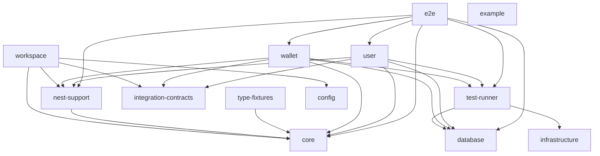
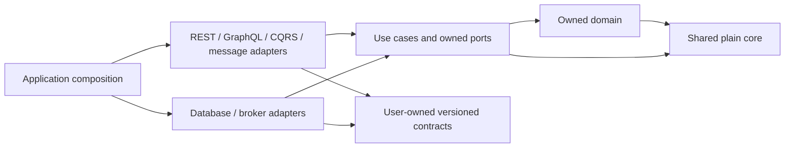

# Nx/Bun migration baseline

Issue [#17](https://github.com/danilomartinelli/vibecoding-starter-js/issues/17)
puts the existing application and regressions under Nx **23.2.1**, with Bun
**1.4.2** for installation, application execution and native tests. Nest stays on
**12.1.1**. The independent [User application](user.md) commits profiles and
pending events in its own database and publishes them in the background. The
[Wallet application](wallet.md) consumes those events with durable deduplication.
Normal start commands run both processes. Each service also has an
[independent distribution](distribution.md). The local plugin supplies
[private library generators](library-generators.md); application generation
remains tracked in [ADR 0002](adr/0002-adopt-nx-with-nest-and-bun.md).
The [User/Wallet language](../GLOSSARY.md) and ADR 0001 supersession note remain
part of that design.

## Projects and ownership

| Nx project              | Root                                 | Responsibility / tests                                                                                                                                                                                                                                |
| ----------------------- | ------------------------------------ | ----------------------------------------------------------------------------------------------------------------------------------------------------------------------------------------------------------------------------------------------------- |
| `type-fixtures`         | `src` (excluding nested projects)    | Compile-only decorator fixture in `src/type-tests`; no runtime or unit suite                                                                                                                                                                          |
| `user`                  | `src/apps/user`                      | Independent User REST/GraphQL, owned profile/outbox transaction, database, migrations and seed; core and external-process component tests including the seven original Gherkin cases                                                                  |
| `wallet`                | `src/apps/wallet`                    | Independent Wallet creation and lookup application with its own domain, creation use case, read and transaction ports, RabbitMQ consumer, adapters, migrations and seed; core tests in `tests/unit`, provisioned component suite in `tests/component` |
| `rabbitmq`              | `src/packages/rabbitmq`              | Technical failure-queue inspection/replay transport. Application component suites cover its real broker behavior; lint and typecheck targets are local.                                                                                               |
| `integration-contracts` | `src/packages/integration-contracts` | Versioned serializable integration envelopes and independent baseline fixtures; infrastructure-free contract tests                                                                                                                                    |
| `core`                  | `src/packages/core`                  | Plain TypeScript DDD primitives, errors, guards, serialization, decorators and technical types; generic error/command tests                                                                                                                           |
| `nest-support`          | `src/packages/nest-support`          | Nest transport DTO helpers, request context, event publication and SQL repository support; exercised through application E2E, no standalone unit suite yet                                                                                            |
| `example`               | `src/packages/example`               | Existing deep-module search-term example and its real unit test; optional starter template                                                                                                                                                            |
| `config`                | `tooling/config`                     | Shared strict ESLint, Prettier and TypeScript settings; checked as JavaScript tooling, no runtime suite                                                                                                                                               |
| `generators`            | `tooling/generators`                 | Local `ts-lib`/`nest-lib` plugin; uncached CLI validation in owned scratch workspaces                                                                                                                                                                 |
| `database`              | `database`                           | Registry and migration/seed tooling for the two owned databases; exercised by live checks, no standalone unit suite                                                                                                                                   |
| `infrastructure`        | `docker`                             | Compose definitions and start commands; formatting applies, no TypeScript/unit target                                                                                                                                                                 |
| `test-runner`           | `scripts`                            | Isolated database provisioning and real Docker lifecycle tests in `scripts/tests`                                                                                                                                                                     |
| `e2e`                   | `tests`                              | Infrastructure-free compatibility matrix (`test`); seven original Gherkin cases and database/API regressions with opt-in setup, including retained-message transitions (`test-compatibility`)                                                         |
| `workspace`             | `.`                                  | Repository formatting and architecture checks                                                                                                                                                                                                         |

`core`, `nest-support`, `integration-contracts`, `rabbitmq`, `example` and `config` are private Bun workspace packages.
The `generators` private workspace package supplies the Nx generator collection.
Runtime package manifests export specific root entry points, with no wildcard
access to internals. Callers use imports such as `@starter/core/domain` and
`@starter/nest-support/context`. The database pool provider and environment
configuration remain application-owned. No shared project contains User/Wallet
business entities, use cases or persistence models. The `user-created` contract
is owned and versioned by User; Wallet consumes its serializable envelope without
importing User implementation. Project ownership is checked against Nx's resolved
graph, and dependency-cruiser checks file-level ownership and layer direction.



Database tooling has its own dotenv loader, so it depends on no application.
The independent applications' edges to `database` and `test-runner` come from their component suites'
environment guard and runner; their production code imports only its own files
and the shared packages. Source imports (including type-only
imports), workspace manifests and the runner's explicit command dependencies
supply the Nx graph. Nx's built-in JavaScript analyzer is explicitly enabled;
package-manifest discovery alone would miss application imports. Shared quality
configuration is also an input of every deterministic target.
The distributed tests start User and Wallet as external processes, so their
runtime dependencies are declared explicitly in `tests/project.json`. Nx
`affected` therefore selects `e2e` when either application changes, including
entry-point changes that have no test-side TypeScript import.
Only these implicit E2E-to-application edges are exempt from Nx's application
privacy rule; importing application implementation from distributed tests still
fails the file-level boundary check.

## Executable boundaries

`bun run lint:boundaries` (also `deps:validate`) runs both checks through
`workspace:boundaries`:

- [.dependency-cruiser.mjs](../.dependency-cruiser.mjs) resolves imports and
  exports across `src`, `tests`, `scripts` and `database`, including type-only
  dependencies, TypeScript path aliases and explicit Bun package exports.
- [check-project-boundaries.ts](../scripts/check-project-boundaries.ts) reads
  `bun run nx graph --print`. It validates application/shared ownership and the
  `type:core` / `type:contracts` constraints, including manifest and implicit
  dependencies that need not appear in a source import. All project cycles fail.

| Source                                          | Allowed dependencies                                                                                            |
| ----------------------------------------------- | --------------------------------------------------------------------------------------------------------------- |
| Application domain                              | Its domain, framework-free shared core, `oxide.ts`                                                              |
| Application use cases, ports and command inputs | Its core (domain/application/commands), shared core, `oxide.ts`                                                 |
| Shared core                                     | Its primitives and `oxide.ts`; no application or adapter                                                        |
| Integration contracts                           | Their schema/validation code and Zod; no application or framework                                               |
| Input adapters                                  | Owned use cases/ports, transport mapping and shared entry points; no persistence imports                        |
| Composition and output adapters                 | Owned implementation and shared entry points                                                                    |
| App component tests                             | Owned implementation, shared entry points, database environment tooling and the explicit cleanup/broker helpers |

For each application, dependencies point toward its core:



Domain/application code and command inputs have no Nest, Slonik, RabbitMQ,
transport DTO, persistence model, concrete adapter or ambient context exception.
Shared packages tagged `type:core` receive the same file-level protection as
the original core. The allowed core is closed under imports: re-exporting an adapter from a core
barrel fails at that export. Shared projects cannot import application code,
so an app-to-shared-to-sibling path also fails. Production imports of test helpers,
private package subfolders, unexported package paths and file cycles fail.
At Nx's project granularity, app edges to the test runner and database tooling
include component tests; the file rules restrict those edges to test code.

[Boundary regressions](../scripts/tests/boundaries.test.ts) execute the real
commands in disposable workspaces. They verify the legal graph, inject invalid
imports/exports and declared Nx edges (including cycles), require nonzero exits
with the expected rule, restore the files and verify success. The Nx cases warm
the boundary cache first so changed project metadata cannot reuse a valid result.
See [developer checks](developer-checks.md) for the full gate and
the [generated file graph](../assets/dependency-graph.svg) for concrete dependencies.

## Commands

Run commands from the repository root. `check:workspace` bootstraps guardrail
tests directly under Bun before the Nx quality commands; `audit:changed`
runs the conditional registry check and `characterize` runs selected tests
against a base worktree, both directly. `bun run nx` invokes the installed local
Nx binary using Bun, without downloading a CLI. It disables Nx's automatic
`.env` loading, preserving the existing explicit environment selection, and
turns off the daemon. Native root `eslint.config.mjs`, `prettier.config.mjs` and
`tsconfig.json` remain usable by tools and editors and import/extend the internal
configuration. Each code project has its own strict typecheck scope.

`bun run characterize -- --base <ref> <test-file>...` copies selected tests to
a temporary base worktree. Run one suite at a time: native tests, distributed
tests under `tests/`, or component tests under one application's
`src/apps/<app>/tests/component/`. Distributed and component suites provision
their own environment and load the corresponding preload; component suites
select `--app=<app>`. Paths may start with `./`. For example:

```sh
bun run characterize -- --base origin/master src/apps/user/tests/component/user-create-command.test.ts
```

```sh
bun install --frozen-lockfile
bun run nx show projects
bun run nx show project user
bun run nx graph
bun run nx graph --file=.context/project-graph.json
bun run nx run core:test
bun run nx run user:typecheck
bun run check
bun run check:full
```

| Package command                                                          | Nx target(s)                                                               |
| ------------------------------------------------------------------------ | -------------------------------------------------------------------------- |
| `lint`, `typecheck`, `lint:fix`                                          | All applicable project `lint` / `typecheck` / `lint-fix` targets           |
| `test`, `test:unit`                                                      | Every project's `test` target                                              |
| `start`, `start:dev`, `start:debug`, `start:prod`                        | `user` and `wallet`: `serve`, `watch`, `debug`; production sets `NODE_ENV` |
| `start:user`, `start:user:dev`, `start:user:debug`                       | `user:serve`, `watch`, `debug`                                             |
| `test:user:component`                                                    | `user:test-component`                                                      |
| `start:wallet`, `start:wallet:dev`, `start:wallet:debug`                 | `wallet:serve`, `watch`, `debug`                                           |
| `test:watch`, `test:cov`                                                 | All existing unit suites' `test-watch` / `test-coverage` targets           |
| `test:debug`                                                             | `user:test-debug`; run another project's `test-debug` target for its suite |
| `test:e2e`, `test:e2e:prepared`                                          | `e2e:e2e`, `e2e:e2e-prepared`                                              |
| `test:distribution`                                                      | Both applications’ uncached `test-distribution` targets                    |
| `test:component`                                                         | Every `test-component` target (`user` and `wallet`)                        |
| `test:tooling`                                                           | `test-runner:test-live`                                                    |
| `migration:up`, `migration:down`, `migration:status`, `migration:create` | Matching `database:migration-*` target                                     |
| `seed:up`                                                                | `database:seed`                                                            |
| `migration:*:tests`, `seed:up:tests`                                     | Corresponding database target with the `test` configuration                |
| `env:prepare`, `env:exec`, `env:down`                                    | `infrastructure:prepare`, `exec`, `down`                                   |
| `docker:env`, `docker:tests`                                             | `infrastructure:up`, `infrastructure:up-test`                              |
| `format:check`, `format`, `lint:boundaries`                              | `workspace:format-check`, `format`, `boundaries`                           |

The environment CLI carries its argument array into its uncached Nx target through
a dedicated process variable, preserving the command after `--` without shell
re-parsing. Each independent CLI invocation starts its own Nx invocation chain, so concurrent
configurations are not misidentified as recursive calls to the same target.
All provisioning still executes in Nx. See [database workflows](database.md).
The disposable test wrapper also starts an independent invocation chain per
owned run. Parallel component targets can therefore migrate the same application
targets against separate databases without triggering false recursion errors.
The runner lifecycle suite holds real migration targets at a barrier to verify
this overlap deterministically in a copied workspace.

Arguments continue through the command chain, for example
`bun run test:e2e --test-name-pattern 'Wallet persistence failure'` and
`bun run migration:create add-user-index`. Direct Bun commands for focused
experiments remain possible; use the package commands for the quality gates.
Unit discovery has no E2E preload. Bare `bun test` runs only `src/packages/core/tests`.
`bun run nx run test-runner:test-broker` runs the pinned-image healthcheck and
container-ownership regressions without provisioning application databases.
This uncached subset runs in CI and is also included in `test:tooling`.
`bun run nx run test-runner:test-gateway` selects the existing environment tests
for loaded gateway upstreams, target overrides, occupied proxy/Admin ports and
failed-setup cleanup. This uncached subset also runs in CI; `test:tooling`
retains the broader development/sibling preservation cases.
For the focused preservation target and its pre-review selection, see
[focused feedback](developer-checks.md#focused-feedback).
The decorator fixture is never a runtime test and remains in
`type-fixtures:typecheck` and `user:typecheck`.

## Cache contract

Only lint, typecheck, unit tests, formatting checks and architecture checks are
cacheable. Inputs include the owning project's files, source dependencies, Bun
runtime version, lockfile, root manifests and shared TypeScript/ESLint/Prettier,
Bun and Nx configuration. Repository-wide checks declare repository-wide inputs;
formatting also includes documentation, root guidance and editor configuration.
The workspace guardrail tests exercise source/configuration invalidation in an
isolated cache on every invocation. Conditional dependency audits always query
the registry when applicable. Both run outside Nx; see [developer checks](developer-checks.md#workspace-and-dependency-guardrails).
These checks produce no build artifact. `.nx` is local and ignored; Nx Cloud is
not required and connections to it are disabled.

Serving, watch/debug/coverage modes, lint fixes, formatting writes, infrastructure, migrations,
seeds, database-runner lifecycle checks, both provisioned/manual live E2E and
service component suites and isolated distribution verification always execute
(`cache: false`). Packaging also remains uncached because it copies the installed
platform-specific dependency tree. `user:distribution` and `wallet:distribution`
write `dist/<app>`; `test:distribution` runs both live verification targets. Use `--skip-nx-cache` to force deterministic checks when
collecting fresh validation evidence.

## Tooling compatibility

Registry manifests were rechecked on September 29, 2026. Nx **23.2.1** was the
maintained stable release. Its matching `@nx/nest` still declares
`@nestjs/common` and `@nestjs/core` peers `>=10.0.0 <12.0.0`, so this baseline uses
`nx:run-commands` and repository-owned configuration. The local library plugin
uses `@nx/devkit` **23.2.1**, aligned with `nx`; it does not install `@nx/nest`
or downgrade Nest. See [library generation](library-generators.md).

The existing compatible TypeScript 6.0.3, typescript-eslint 8.71.0, ESLint 10.11.0
and Prettier 3.9.9 are retained. Nx's vulnerable transitive `smol-toml` 1.6.1 is
overridden with stable 1.9.0; see the [dependency inventory](dependencies.md).

Sources: [Nx manifest](https://registry.npmjs.org/nx/23.2.1),
[Nx Nest peer manifest](https://registry.npmjs.org/@nx%2fnest/23.2.1),
[Nx custom commands](https://nx.dev/docs/reference/nx/executors#run-commands).
